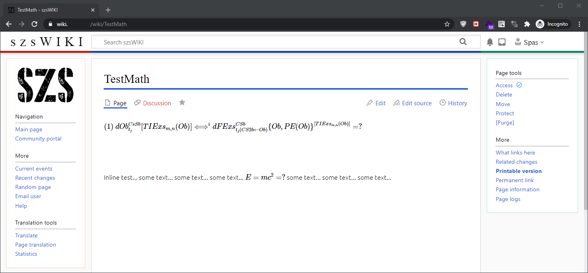

# Purpose of this fork 

In this version of [Extension:SimpleMathJax](https://www.mediawiki.org/wiki/Extension:SimpleMathJax) is added some integration with [Extension:VisualEditor](https://www.mediawiki.org/wiki/Extension:VisualEditor).

For this purpose on the base of the original file [`ext.SimpleMathJax.js`](resources/ext.SimpleMathJax.js) is created the file [`ext.SimpleMathJax.VE.js`](resources/ext.SimpleMathJax.VE.js) where along with `mw.hook('wikipage.categories')` is used also [`mw.hook('ve.activationComplete')`](https://www.mediawiki.org/wiki/VisualEditor/Gadgets#Running_code_after_VisualEditor_is_activated). Within this hook the method [`MathJax.typesetPromise()`](http://docs.mathjax.org/en/latest/web/typeset.html) is engaged. 
In this way the math expressions will be rendered within VisualEditor. When you are making some changes in the math expressions you will need to press `Ctrl`+`Shift` in order to render them again.

There are two variants of usage:

1. **SimpleMathJax** stand alone usage.

    In this case just add `wfLoadExtension( 'SimpleMathJax' );` in your `LocalSettings.php` as it is described in the original [installation guide](#Installation). Here is a demo:

	

2. **SimpleMathJax** along with [Extension:Math](https://www.mediawiki.org/wiki/Extension:Math). In this scenario you need to **load Extension:Math before Extension:Math** in your `LocalSettings.php`. Here is a sample code from my wiki:

	```php
	wfLoadExtension( 'Math' );
	wfLoadExtension( 'SimpleMathJax' );

	// not mandatory option: 
	// add `class="mwe-math-element"` to the SimpleMathJax's output
	// in order to apply the same CSS code as extension Math
	function SimpleMathJaxAddClass( array &$attributes, $tex ) {
        $attributes['class'] = 'mwe-math-element'; 
	}
	$wgHooks['SimpleMathJaxAttributes'][] = 'SimpleMathJaxAddClass';
	```

	In this case we will use Extension:Math features but the formulas will be rendered by Extension:SimpleMathJax. Here is a demo:

	

# THE ORIGINAL README.md

The SimpleMathJax extension enables MathJax, a Javascript library, for typesetting TeX formula in MediaWiki inside math environments.

https://www.mediawiki.org/wiki/Extension:SimpleMathJax


# Installation
* git clone in extensions directory
* Using CDN is recommended. Because it's much faster than using local resources in most cases. ("the benefits of using a CDN")
```Bash
$ git clone https://github.com/jmnote/SimpleMathJax.git
```

* (Optional) If you want to use not CDN but local mathjax scripts, you can use git clone recursive.
```Bash
$ git clone --recursive https://github.com/jmnote/SimpleMathJax.git
```

* LocalSetting.php
```PHP
wfLoadExtension( 'SimpleMathJax' );
```

# Optional Settings
| Setting name             | Description                      | default value | custom value example        |
| ------------------------ | -------------------------------- | ------------- | --------------------------- |
| `$wgSmjUseCdn`           | use CDN or local scripts         | true          | false                       |
| `$wgSmjUseChem`          | enable chem tag                  | true          | false                       |
| `$wgSmjEnableMenu`       | MathJax.options.enableMenu       | true          | false                       |
| `$wgSmjDisplayMath`      | MathJax.tex.displayMath          | []            | [['$$','$$'],['\\[','\\]']] |
| `$wgSmjExtraInlineMath`  | MathJax.tex.inlineMath           | []            | [['\\(', '\\)']]            |
| `$wgSmjScale`            | MathJax.chtml.scale              | 1             | 1.5                         |
| `$wgSmjDisplayAlign`     | MathJax.chtml.displayAlign       | center        | left                        |
| `$wgSmjWrapDisplaystyle` | wrap with displaystyle           | true          | false                       |

If you want to change font size, set `$wgSmjScale`.
```PHP
wfLoadExtension( 'SimpleMathJax' );
$wgSmjScale = 1.5;
```

If you want to use local module, set `$wgSmjUseCdn`.
```PHP
wfLoadExtension( 'SimpleMathJax' );
$wgSmjUseCdn = false;
```

If you want to enable some extra inlineMath symbol pairs, set `$wgSmjExtraInlineMath`.
```PHP
wfLoadExtension( 'SimpleMathJax' );
$wgSmjExtraInlineMath = [["$","$"],["\\(","\\)"]];
```

If you want to disable MathJax context menu, set `$wgSmjEnableMenu`.
```PHP
wfLoadExtension( 'SimpleMathJax' );
$wgSmjEnableMenu = false;
```

# Hooks
The hook `SimpleMathJaxAttributes` is available to add attributes to the span around the math. This hook provides you with the opportunity to ensure that your own code does not interfere with MathJax's rendering of math.

For instance, if Lingo's JS functions are called before MathJax is invoked, then it is possible that Lingo will change the text so that MathJax could no longer render the math.

Lingo understands that [it should not touch anything inside an element with the class `noglossary`](https://www.mediawiki.org/wiki/Extension:Lingo#Excluding_text_from_markup) so the following code can be used to keep Lingo from ruining math:
```PHP
$wfHook['SimpleMathJaxAttributes']
	= function ( array &attributes, string $tex ) {
		$attributes['class'] = 'noglossary';
	}
```
